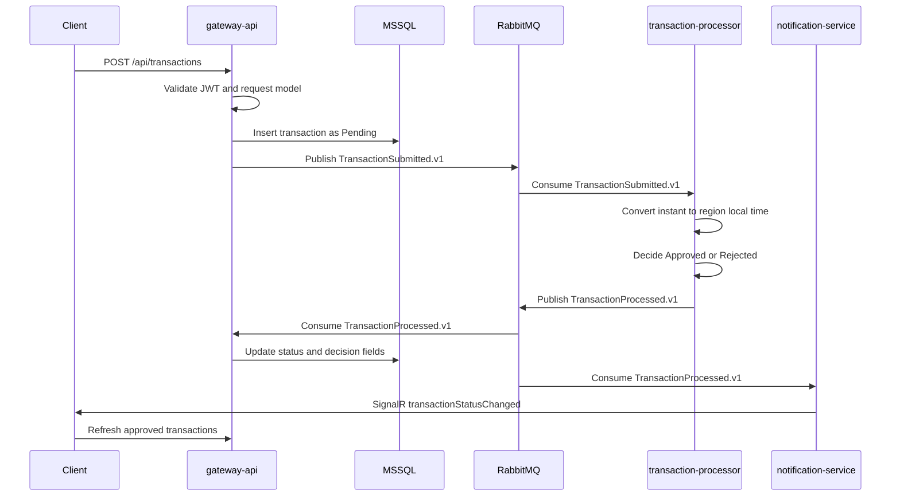

# Architecture

The project uses a microservice-inspired architecture while staying small enough for a take-home assignment and interview walkthrough.

## Components

| Component | Responsibility |
| --- | --- |
| `client` | React + Material UI app, JWT login, localization, transaction submission, approved transaction views, SignalR updates, Nginx static hosting and proxying in Docker |
| `gateway-api` | Public REST API, request validation, JWT issuing and validation, transaction persistence, submitted-event publishing, processed-event consumption |
| `transaction-processor` | RabbitMQ worker that evaluates approval rules and publishes processed events |
| `notification-service` | RabbitMQ processed-event consumer and SignalR hub for browser updates |
| `mssql` | Source of truth for submitted transactions |
| `rabbitmq` | Local message broker for transaction workflow events |
| `BuildingBlocks/Contracts` | Shared API DTOs, event records, auth options, region mappings, and transaction enums |

## Transaction Flow

## Service Responsibilities

### Gateway API

- Exposes `POST /api/auth/login`.
- Exposes authenticated transaction endpoints under `/api/transactions`.
- Uses `ValidateModelAttribute` so invalid models return validation problem responses consistently.
- Stores new transactions as `Pending`.
- Publishes `TransactionSubmitted.v1`.
- Consumes `TransactionProcessed.v1` and updates the stored transaction.
- Owns all database writes in this implementation.

### Transaction Processor

- Consumes `TransactionSubmitted.v1`.
- Maps the submitted UTC instant to the selected region time zone.
- Applies the banking-hours rule: local time must be from `08:00` through `18:00`.
- Publishes `TransactionProcessed.v1` with status, local submitted time, time zone, and decision reason.
- Does not access the database.

### Notification Service

- Hosts the SignalR hub at `/ws/transactions`.
- Validates JWTs for hub connections.
- Consumes `TransactionProcessed.v1`.
- Pushes `transactionStatusChanged` messages to connected clients.
- Does not own persistence.

### Client

- Shows a login screen while logged out.
- Stores the active JWT session in browser storage and clears stale sessions.
- Submits transactions through the gateway.
- Connects to SignalR for status updates.
- Shows only approved transactions in the bottom transaction cards.
- Supports English/Hebrew localization and RTL-aware layout.
- Provides focused and detailed views through the user menu.

## Contracts

Contracts are shared through `src/backend/BuildingBlocks/Contracts` to keep the assignment readable:

- API contracts: auth, transaction create/list/get, notification messages.
- Event contracts: `TransactionSubmittedV1`, `TransactionProcessedV1`.
- Domain constants: banking hours, supported regions, region time zones.
- Auth configuration and transaction status enum.

In a production system, these contracts would likely be packaged and versioned independently. For this assignment, a shared project keeps the important boundaries visible without adding package-management overhead.

## Data Ownership

`gateway-api` owns the SQL Server database writes. The processor and notification service communicate through RabbitMQ events and do not mutate the database directly.

This keeps the demo simple and avoids distributed transactions. The tradeoff is that the gateway has both API and projection-update responsibilities.

## Authentication

Authentication is intentionally simple:

- `POST /api/auth/login` validates a single development user from configuration.
- The gateway issues a signed JWT.
- Gateway endpoints require `Authorization: Bearer <token>`.
- SignalR connections pass the same access token.
- The client logs out automatically when a stored token is expired or an API request returns `401`.

No separate auth service is used. A dedicated auth service would add deployment and token-introspection complexity without improving the assignment's core signal.

## Time-Zone Rule

The processor treats the submitted value as an instant, converts it to the selected region's IANA time zone, and checks local banking hours.

Supported regions and time zones are centralized in `RegionTimeZoneIds`. Banking hours are centralized in `BankingHours`.

Current rule:

- Approved: local time is between `08:00` and `18:00`, inclusive.
- Rejected: local time is outside that range.

The implementation intentionally does not include banking holidays, weekends, or region-specific calendar rules.

## RabbitMQ

Events are versioned and published to named exchanges:

- `TransactionSubmitted.v1` goes to the processor queue.
- `TransactionProcessed.v1` goes to both the gateway queue and notification-service queue.

RabbitMQ is preferred over Kafka for this assignment because it is lightweight to run locally, easy to inspect through the management UI, and enough for the required asynchronous workflow.

## SignalR

SignalR is used only for notifying clients that a transaction status changed. The client still refreshes approved transactions from the gateway so the UI remains consistent with persisted state.

This gives a clear real-time demo without making SignalR the source of truth.

## Container Networking

`docker compose up --build` runs the client, gateway, processor, notification service, MSSQL, and RabbitMQ.

The browser opens `http://localhost:5173`. The client container serves the built React app through Nginx and proxies:

- `/api` to `gateway-api:8080`.
- `/ws` to `notification-service:8080`.

The gateway and notification service are intentionally not published to host ports in the Compose setup. This keeps the single-command demo focused on the client URL and avoids conflicts with host-run backend services during development.

The backend containers use Docker DNS names for service-to-service communication:

- `gateway-api` connects to `mssql:1433` and `rabbitmq:5672`.
- `transaction-processor` connects to `rabbitmq:5672`.
- `notification-service` connects to `rabbitmq:5672`.

## Simplifications

- One monorepo.
- One SQL Server database.
- One RabbitMQ broker.
- Shared contracts project instead of independently versioned packages.
- Gateway owns write-side persistence and processed-event updates.
